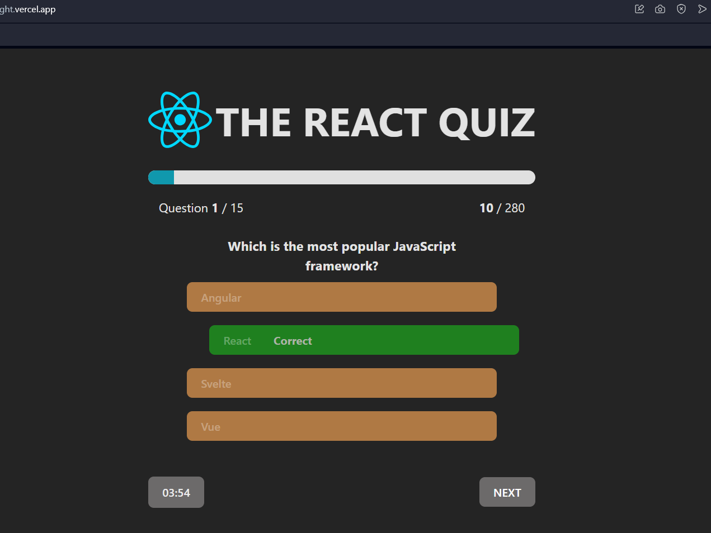
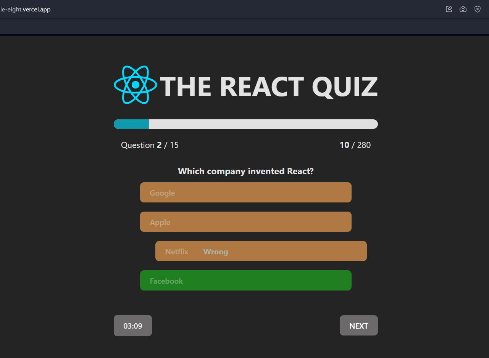

# React Quiz

ReactiQuiz is an interactive quiz application built using React that fetches questions from an external API. The application presents multiple-choice questions to the user. Points are awarded for correct answers, while no points are given for incorrect answers.

## Features

- Fetches quiz questions from an external API.
  

  ## Please note: There might be a delay in loading questions due to the API response time. This could be related to issues with the API hosting service (Render or Vercel)._

-Start the quiz

- Displays questions one at a time.
  

- Awards points for correct answers.
  

- No points are awarded for incorrect answers.
  

- Automatically ends the quiz when pressing the "Finish" button or the timer runs out.
  

- Displays the final score at the end of the quiz.
  

- resposive app

  
  

This template provides a minimal setup to get React working in Vite with HMR and some ESLint rules.

Currently, two official plugins are available:

- [@vitejs/plugin-react](https://github.com/vitejs/vite-plugin-react/blob/main/packages/plugin-react/README.md) uses [Babel](https://babeljs.io/) for Fast Refresh
- [@vitejs/plugin-react-swc](https://github.com/vitejs/vite-plugin-react-swc) uses [SWC](https://swc.rs/) for Fast Refresh
